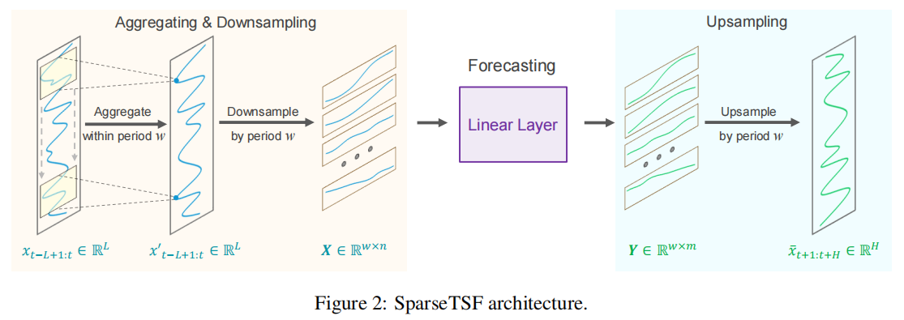
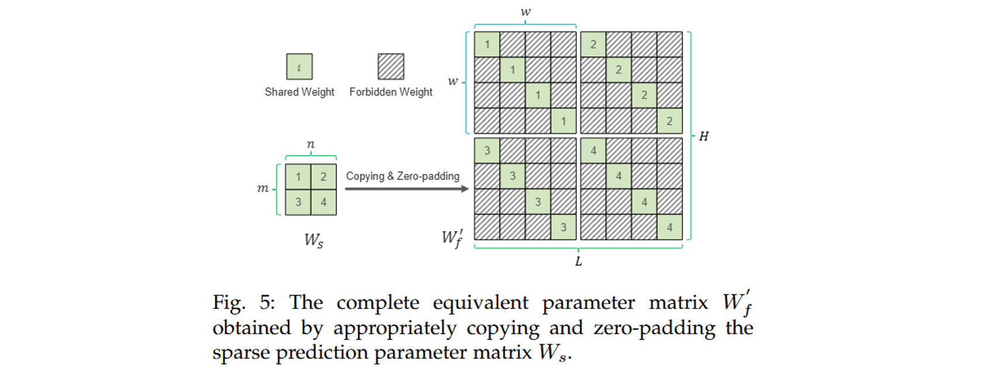
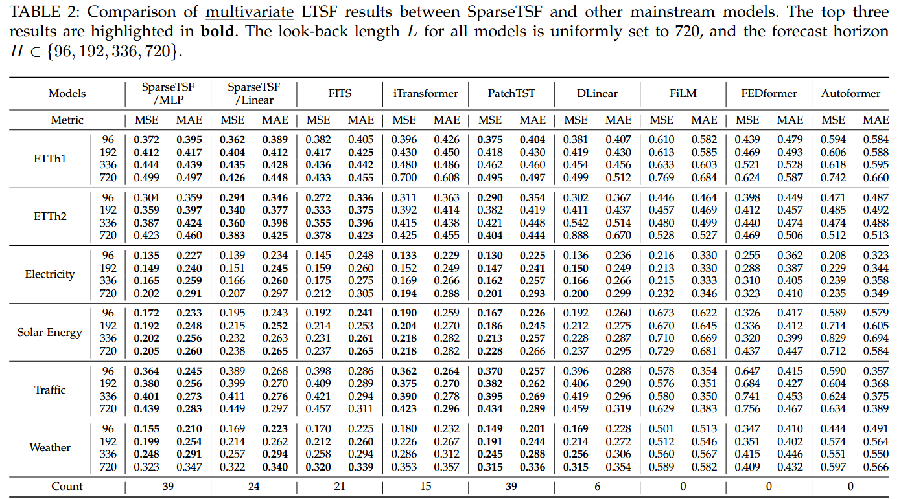
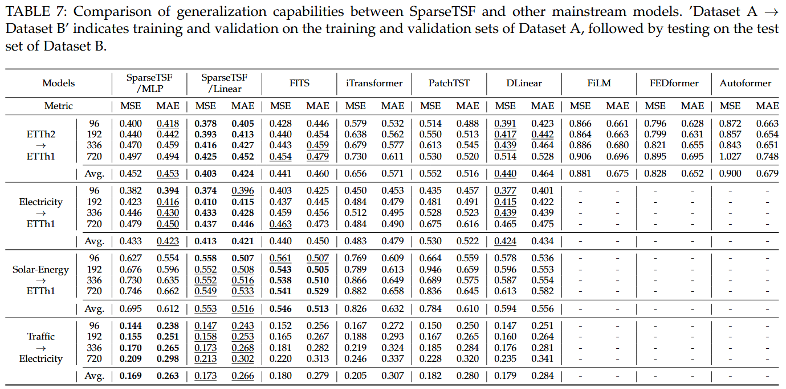
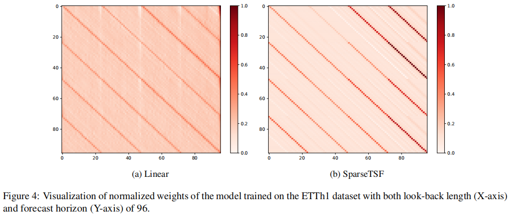
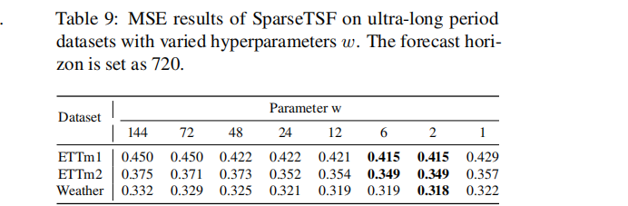
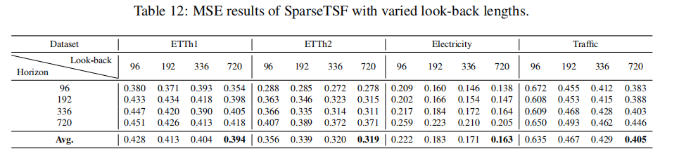

# SparseTSF

Welcome to the official repository of the SparseTSF paper: "[SparseTSF: Modeling Long-term Time Series Forecasting with *1k* Parameters](https://arxiv.org/pdf/2405.00946)"

## Updates
🚩 **News** (2024.10)
We have introduced a new variant, **SparseTSF/MLP**, which replaces the fully connected linear layer with a dual-layer MLP structure. SparseTSF/MLP enhances non-linear learning capabilities, demonstrating stronger competitiveness on _high-dimensional multivariate datasets_, such as Traffic (Average MSE **0.412 -> 0.396**).

🚩 **News** (2024.09) Another one of our recent works, [CycleNet](https://github.com/ACAT-SCUT/CycleNet) has been accepted as **NeurIPS 2024 Spotlight**.
CycleNet, similar to SparseTSF, focuses on _leveraging data periodicity_. However, it distinguishes itself by introducing a novel RCF technique, which uses _**learnable** recurrent cycles_ to explicitly model periodic patterns.

🚩 **News** (2024.07) We have now fixed a long-standing bug (see description in [FITS](https://github.com/VEWOXIC/FITS) and [TFB](https://github.com/decisionintelligence/TFB) ) in the code framework and supplemented the full results (including **MSE and MAE**) of SparseTSF after fixing the bug in [this table](https://github.com/lss-1138/SparseTSF?tab=readme-ov-file#full-results).

🚩 **News** (2024.06) SparseTSF paper has been selected for an **_Oral_** presentation at ICML 2024 (acceptance rate less than 1.5%).

🚩 **News** (2024.05) SparseTSF has been accepted as a paper at **_ICML 2024_**, receiving an average rating of 7 with confidence of 4.5.

## Introduction
SparseTSF is a novel, extremely lightweight model for Long-term Time Series Forecasting (LTSF).
At the heart of SparseTSF lies the **Cross-Period Sparse Forecasting** technique, which simplifies the forecasting task by decoupling the periodicity and trend in time series data.

Technically, it first downsamples the original sequences with constant periodicity into subsequences, then performs predictions on each downsampled subsequence, simplifying the original time series forecasting task into a cross-period trend prediction task. 



Intuitively, SparseTSF can be perceived as a sparsely connected linear layer performing sliding prediction across periods



This approach yields two benefits: (i) effective decoupling of data periodicity and trend, enabling the model to stably identify and extract periodic features while focusing on predicting trend changes, and (ii) extreme compression of the model's parameter size, significantly reducing the demand for computational resources.



SparseTSF achieves near state-of-the-art prediction performance with less than **_1k_** trainable parameters, which makes it **_1 ~ 4_** orders of magnitude smaller than its counterparts.


Additionally, SparseTSF showcases remarkable generalization capabilities (cross-domain), making it well-suited for scenarios with limited computational resources, small samples, or low-quality data.



From the distribution of normalized weights for both the trained Linear model and the SparseTSF model, it can be observed that SparseTSF learns more distinct, evenly spaced weight distribution stripes compared to the Linear model. This indicates that SparseTSF has a stronger capability in extracting periodic features. This benefit arises because the Sparse technique enables the model to focus more effectively on cross-period historical information.



Note a special case where the dataset’s period is excessively large (for instance, a period of 144 for ETTm1). Resampling with too large a period results in very short subsequences with sparse connections, leading to underutilization of information. In such cases, setting the period length to [2-6], i.e., adopting a denser sparse strategy, can be beneficial. This might be because an appropriate sparse strategy can help the model focus more on useful information and reduce the influence of irrelevant noise. We will continue to explore this aspect in future research.



Through examining SparseTSF’s performance with varying input lengths, we can observe that the model experiences a significant performance shift with input lengths of 96-192 on the Electricity and Traffic datasets. This is because Traffic not only has a significant daily periodic pattern (w = 24) but also a noticeable weekly periodic pattern (w = 168). In this case, a look-back of 96 cannot cover the entire weekly periodic pattern, leading to a significant performance drop. 



This underscores the necessity of sufficiently long look-back lengths (at least covering the entire cycle length) for accurate prediction. Given the extremely lightweight nature of SparseTSF, we strongly recommend providing sufficiently long look-back windows whenever feasible. Therefore, SparseTSF defaults to using an input length of 720. Even with this configuration, predicting a super long horizon of 720 on these datasets requires only 925 parameters (less than 1K).


## Getting Started

### Environment Requirements

To get started, ensure you have Conda installed on your system and follow these steps to set up the environment:

```
conda create -n SparseTSF python=3.8
conda activate SparseTSF
pip install -r requirements.txt
```

### Data Preparation

All the datasets needed for SparseTSF can be obtained from the [Google Drive](https://drive.google.com/drive/folders/1ZOYpTUa82_jCcxIdTmyr0LXQfvaM9vIy) provided in Autoformer. 
Create a separate folder named ```./dataset``` and place all the CSV files in this directory. 
**Note**: Place the CSV files directly into this directory, such as "./dataset/ETTh1.csv"

### Training Example

You can easily reproduce the results from the paper by running the provided script command. For instance, to reproduce the main results, execute the following command:

```
sh run_all.sh
```

Similarly, you can specify separate scripts to run independent tasks, such as obtaining results on etth1:

```
sh scripts/SparseTSF/etth1.sh
```

## Usage on Your Data

SparseTSF relies on the inherent periodicity in the data. If you intend to use SparseTSF on your data, please first ascertain **whether your data exhibits periodicity**, which can be determined through ACF analysis. 

We provide an example in the [ACF_ETTh1.ipynb](https://github.com/lss-1138/SparseTSF/blob/main/ACF_ETTh1.ipynb) notebook to determine the primary period of the ETTh1 dataset. You can utilize it to ascertain the periodicity of your dataset and set the `period_len` parameter accordingly.
Alternatively, you can set it to [2-6] when the period length is excessively large, as mentioned earlier.

## Further Reading

The objective of this work is to explore an **ultra-lightweight** yet sufficiently powerful method to be applicable in edge scenarios with limited resources and small datasets for transfer learning and generalization. 

If you seek higher predictive performance, we recommend our alternative work, **[SegRNN](https://github.com/lss-1138/SegRNN)**, which is an innovative RNN-based model specifically designed for LTSF. By integrating Segment-wise Iterations and Parallel Multi-step Forecasting (PMF) strategies, SegRNN achieves state-of-the-art results with just a single layer of GRU, making it extremely lightweight and efficient.

## Citation
If you find this repo useful, please cite our paper.
```
@inproceedings{sparsetsf,
  title={SparseTSF: Modeling Long-term Time Series Forecasting with 1k Parameters},
  author={Lin, Shengsheng and Lin, Weiwei and Wu, Wentai and Chen, Haojun and Yang, Junjie},
  booktitle={Forty-first International Conference on Machine Learning},
  year={2024}
}
```


## Full results
There was a longstanding bug in our current framework where the last batch of data was discarded during the testing phase (i.e., `drop_last = False`). This might have affected the model's performance, especially when using a large batch size on small datasets. We have now fixed this issue (see [data_provider/data_factory.py](https://github.com/lss-1138/SparseTSF/blob/8ae055490fb8878fd302e5b6bd43803beb5bb763/data_provider/data_factory.py#L19) and [exp/exp_main.py](https://github.com/lss-1138/SparseTSF/blob/8ae055490fb8878fd302e5b6bd43803beb5bb763/exp/exp_main.py#L297)).

We have now supplemented the full results (including **MSE and MAE**) of SparseTSF after fixing the bug as follows.  Herein, we consistently used a lookback length of 720 and MSE as the loss function. For FITS, we defaulted to using COF at the 5th harmonic.


|             |  | SegRNN |  | FITS |  | SparseTSF |  |
|:-----------:|:---:|:---:|:---:|:---:|:---:|:---:|:---:|
|   Dataset   | Horizon | MSE | MAE | MSE | MAE | MSE | MAE |
|    ETTh1    | 96 |**0.351** | 0.392 | 0.382  | 0.405  | 0.362 |**0.388** |
|             | 192 |**0.390** | 0.418  | 0.417  | 0.425  | 0.403  |**0.411** |
|             | 336 | 0.449  | 0.452  | 0.436  | 0.442  |**0.434** |**0.428** |
|             | 720 | 0.492  | 0.494  | 0.433  | 0.455  |**0.426** |**0.447** |
|    ETTh2    | 96 | 0.275  | 0.338  |**0.272** |**0.336** | 0.294  | 0.346  |
|             | 192 | 0.338  | 0.380  |**0.333** |**0.375** | 0.339  | 0.377  |
|             | 336 | 0.419  | 0.445  |**0.355** |**0.396** | 0.359  | 0.397  |
|             | 720 | 0.431  | 0.464  |**0.378** |**0.423** | 0.383  | 0.424  |
|    ETTm1    | 96 | 0.295  | 0.356  | 0.311  | 0.354  | 0.312  | 0.354  |
|             | 192 |**0.334** | 0.382  | 0.340  |**0.369** | 0.347  | 0.376  |
|             | 336 |**0.359** | 0.401  | 0.367  |**0.385** | 0.367  | 0.386  |
|             | 720 |**0.415** | 0.435  | 0.416  |**0.412** | 0.419  | 0.413  |
|    ETTm2    | 96 |**0.165** |**0.251** |**0.163** | 0.254  |**0.163** | 0.252  |
|             | 192 | 0.226  | 0.300  |**0.217** | 0.291  |**0.217** |**0.290** |
|             | 336 | 0.282  | 0.341  |**0.268** |**0.326** | 0.270  | 0.327  |
|             | 720 | 0.361  | 0.392  |**0.349** |**0.378** | 0.352  | 0.379  |
| Electricity | 96 |**0.130** |**0.228** | 0.145  | 0.248  | 0.138  | 0.233  |
|             | 192 | 0.152  | 0.251  | 0.159  | 0.260  |**0.151** |**0.244** |
|             | 336 | 0.170  | 0.272  | 0.175  | 0.275  |**0.166** |**0.260** |
|             | 720 |**0.203** | 0.304  | 0.212  | 0.305  | 0.205  |**0.293** |
|    Solar    | 96 |**0.175** |**0.236** | 0.192  | 0.241  | 0.195  | 0.243  |
|             | 192 |**0.193** | 0.268  | 0.214  |**0.253** | 0.215  | 0.254  |
|             | 336 |**0.209** | 0.263  | 0.231  |**0.261** | 0.232  | 0.262  |
|             | 720 |**0.205** | 0.264  | 0.237  | 0.265  | 0.237  |**0.263** |
|   traffic   | 96 |**0.356** |**0.255** | 0.398  | 0.286  | 0.389  | 0.268  |
|             | 192 |**0.374** |**0.268** | 0.409  | 0.289  | 0.398  | 0.270  |
|             | 336 |**0.393** |**0.273** | 0.421  | 0.294  | 0.411  | 0.275  |
|             | 720 |**0.434** |**0.294** | 0.457  | 0.311  | 0.448  | 0.297  |
|   weather   | 96 |**0.141** |**0.205** | 0.170  | 0.225  | 0.169  | 0.223  |
|             | 192 |**0.185** |**0.250** | 0.212  | 0.260  | 0.214  | 0.262  |
|             | 336 |**0.241** | 0.297  | 0.258  | 0.294  | 0.257  |**0.293** |
|             | 720 |**0.318** | 0.352  | 0.320  |**0.339** | 0.321  | 0.340  |


## Contact
If you have any questions or suggestions, feel free to contact:
- Shengsheng Lin ([cslinshengsheng@mail.scut.edu.cn]())
- Weiwei Lin ([linww@scut.edu.cn]())
- Wentai Wu ([wentaiwu@jnu.edu.cn]())

## Acknowledgement

We extend our heartfelt appreciation to the following GitHub repositories for providing valuable code bases and datasets:

https://github.com/lss-1138/SegRNN

https://github.com/VEWOXIC/FITS

https://github.com/yuqinie98/patchtst

https://github.com/cure-lab/LTSF-Linear

https://github.com/zhouhaoyi/Informer2020

https://github.com/thuml/Autoformer

https://github.com/MAZiqing/FEDformer

https://github.com/alipay/Pyraformer

https://github.com/ts-kim/RevIN

https://github.com/timeseriesAI/tsai


