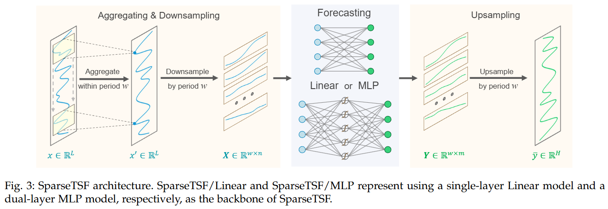

# SparseTSF


[[Poster|海报]](https://drive.google.com/file/d/1pJ32EdIPgtRAYTQWYd768N6lPxtDx3sV/view?usp=drive_link) -
[[Slides|幻灯片]](https://drive.google.com/file/d/1UJOwT0SOEoBsPVaLEBX4gMhNKZX7CF9q/view?usp=drive_link) - 
[[中文解读]](https://zhuanlan.zhihu.com/p/701070533)

Welcome to the official repository of the SparseTSF paper: 

**Conference** version **(ICML 2024 Oral)**："[SparseTSF: Modeling Long-term Time Series Forecasting with *1k* Parameters](https://arxiv.org/pdf/2405.00946)"

**Journal** version **(TPAMI 2025)**: "[SparseTSF: Lightweight and Robust Time Series Forecasting via Sparse Modeling](https://ieeexplore.ieee.org/abstract/document/11141354)" 


If this is your first time learning about SparseTSF, we highly recommend starting with the [Journal version (TPAMI 2025)](https://ieeexplore.ieee.org/abstract/document/11141354), which provides a more comprehensive and thorough introduction, theoretical analysis, and experimental evaluation.


## Updates
🚩 **News** (2025.08): 
Congratulations! The extended version of SparseTSF has been accepted by **[TPAMI 2025](https://ieeexplore.ieee.org/abstract/document/11141354)**. It introduces three new contributions:
(i) a new variant **SparseTSF/MLP**; (ii) a more in-depth theoretical analysis regarding **implicit regularization**; (iii) a more comprehensive and **extensive evaluation**.

🚩 **News** (2025.05): Our latest work, [**TQNet**](https://github.com/ACAT-SCUT/TQNet), has been accepted to **ICML 2025**. TQNet is a powerful successor to [**CycleNet**](https://github.com/ACAT-SCUT/CycleNet), addressing its limitation in *modeling inter-variable correlations* effectively.

🚩 **News** (2024.10):
We have introduced a new variant, **SparseTSF/MLP**, which replaces the fully connected linear layer with a dual-layer MLP structure. SparseTSF/MLP enhances non-linear learning capabilities, demonstrating stronger competitiveness on _high-dimensional multivariate datasets_, such as Traffic (Average MSE **0.412 -> 0.396**).

🚩 **News** (2024.09): Another one of our recent works, [**CycleNet**](https://github.com/ACAT-SCUT/CycleNet) has been accepted as **NeurIPS 2024 Spotlight**.
CycleNet, similar to SparseTSF, focuses on _leveraging data periodicity_. However, it distinguishes itself by introducing a novel RCF technique, which uses _**learnable** recurrent cycles_ to explicitly model periodic patterns.

🚩 **News** (2024.07): We have now fixed a long-standing bug (see description in [FITS](https://github.com/VEWOXIC/FITS) and [TFB](https://github.com/decisionintelligence/TFB) ) in the code framework and supplemented the full results (including **MSE and MAE**) of SparseTSF after fixing the bug in [this table](https://github.com/lss-1138/SparseTSF?tab=readme-ov-file#full-results).

🚩 **News** (2024.06): **SparseTSF** paper has been accepted as **ICML 2024 _Oral_** (acceptance rate less than 1.5%).

**Please note that** [**SparseTSF**](https://github.com/lss-1138/SparseTSF), [**CycleNet**](https://github.com/ACAT-SCUT/CycleNet), and [**TQNet**](https://github.com/ACAT-SCUT/TQNet) represent our continued exploration of **leveraging periodicity** for long-term time series forecasting (LTSF). 
The differences and connections among them are as follows:

|                            Model                             |        Use of Periodicity         |            Technique             |                   Effect                   |      Efficiency      |                   Strengths                   |                      Limitation                       |
| :----------------------------------------------------------: | :-------------------------------: | :------------------------------: | :----------------------------------------: | :------------------: | :-------------------------------------------: | :---------------------------------------------------: |
| [**SparseTSF**](https://github.com/lss-1138/SparseTSF)  <br> **(ICML 2024 Oral**) |    Indirectly via downsampling    | Cross-Period Sparse Forecasting  |             Ultra-light design             |   < 1k parameters    |       Extremely lightweight, near SOTA        | Fails to cover multi-periods **(solved by CycleNet)** |
| [**CycleNet**](https://github.com/ACAT-SCUT/CycleNet) <br> **(NeurIPS 2024 Spotlight)** | Explicit via learnable parameters | Residual Cycle Forecasting (RCF) |         Better use of periodicity          | 100k ~ 1M parameters |      Strong performance on periodic data      | Fails in multivariate modeling **(solved by TQNet)**  |
|                  [**TQNet**](https://github.com/ACAT-SCUT/TQNet) <br> **(ICML 2025)**                   |    Serve as global correlations     |   Temporal Query in attention mechanism  | Robust inter-variable correlation modeling |    ~1M parameters    | Enhanced multivariate forecasting performance |     Hard to scale to ultra-long look-back inputs      |

## Introduction
SparseTSF is a novel, extremely lightweight model for Long-term Time Series Forecasting (LTSF).
At the heart of SparseTSF lies the **Cross-Period Sparse Forecasting** technique, which simplifies the forecasting task by decoupling the periodicity and trend in time series data.

Technically, it first downsamples the original sequences with constant periodicity into subsequences, then performs predictions on each downsampled subsequence, simplifying the original time series forecasting task into a cross-period trend prediction task. 



Intuitively, SparseTSF can be perceived as a sparsely connected linear layer performing sliding prediction across periods


This approach yields two benefits: (i) effective decoupling of data periodicity and trend, enabling the model to stably identify and extract periodic features while focusing on predicting trend changes, and (ii) extreme compression of the model's parameter size, significantly reducing the demand for computational resources.


SparseTSF achieves near state-of-the-art prediction performance with less than **_1k_** trainable parameters, which makes it **_1 ~ 4_** orders of magnitude smaller than its counterparts.


Additionally, SparseTSF showcases remarkable generalization capabilities (cross-domain), making it well-suited for scenarios with limited computational resources, small samples, or low-quality data.


The proposed Sparse technique functions as a form of **structural implicit regularization**, guiding the model to focus on the most informative elements within historical periods. This mechanism substantially improves the model’s robustness.


Furthermore, the distribution of normalized weights learned by the trained SparseTSF model provides additional evidence for this effect.


## Getting Started

### Environment Requirements

To get started, ensure you have Conda installed on your system and follow these steps to set up the environment:

```
conda create -n SparseTSF python=3.8
conda activate SparseTSF
pip install -r requirements.txt
```

### Data Preparation

All the datasets needed for SparseTSF can be obtained from the [Google Drive](https://drive.google.com/drive/folders/1ZOYpTUa82_jCcxIdTmyr0LXQfvaM9vIy) provided in Autoformer. 
Create a separate folder named ```./dataset``` and place all the CSV files in this directory. 
**Note**: Place the CSV files directly into this directory, such as "./dataset/ETTh1.csv"

### Training Example

You can easily reproduce the results from the paper by running the provided script command. For instance, to reproduce the main results, execute the following command:

```
sh run_all.sh
```

Similarly, you can specify separate scripts to run independent tasks, such as obtaining results on etth1:

```
sh scripts/SparseTSF/linear/etth1.sh;
```

## Usage on Your Data

SparseTSF relies on the inherent periodicity in the data. If you intend to use SparseTSF on your data, please first ascertain **whether your data exhibits periodicity**, which can be determined through ACF analysis. 

We provide an example in the [ACF_ETTh1.ipynb](https://github.com/lss-1138/SparseTSF/blob/main/ACF_ETTh1.ipynb) notebook to determine the primary period of the ETTh1 dataset. You can utilize it to ascertain the periodicity of your dataset and set the `period_len` parameter accordingly.
Alternatively, you can set it to [2-6] when the period length is excessively large, as mentioned in the paper.


## Contact
If you have any questions or suggestions, feel free to contact:
- Shengsheng Lin ([cslinshengsheng@mail.scut.edu.cn]())
- Weiwei Lin ([linww@scut.edu.cn]())
- Wentai Wu ([wentaiwu@jnu.edu.cn]())


## Citation
If you find this repo useful, please cite our paper.

```
@article{lin2025sparsetsf,
  title={SparseTSF: Lightweight and Robust Time Series Forecasting via Sparse Modeling},
  author={Lin, Shengsheng and Lin, Weiwei and Wu, Wentai and Chen, Haojun and Chen, CL Philip},
  journal={IEEE Transactions on Pattern Analysis and Machine Intelligence},
  year={2025},
  publisher={IEEE}
}
```

```
@inproceedings{lin2024sparsetsf,
  title={SparseTSF: Modeling Long-term Time Series Forecasting with 1k Parameters},
  author={Lin, Shengsheng and Lin, Weiwei and Wu, Wentai and Chen, Haojun and Yang, Junjie},
  booktitle={Forty-first International Conference on Machine Learning},
  year={2024}
}
```


## Acknowledgement

We extend our heartfelt appreciation to the following GitHub repositories for providing valuable code bases and datasets:

https://github.com/lss-1138/SegRNN

https://github.com/VEWOXIC/FITS

https://github.com/yuqinie98/patchtst

https://github.com/cure-lab/LTSF-Linear

https://github.com/zhouhaoyi/Informer2020

https://github.com/thuml/Autoformer

https://github.com/MAZiqing/FEDformer

https://github.com/alipay/Pyraformer

https://github.com/ts-kim/RevIN

https://github.com/timeseriesAI/tsai


